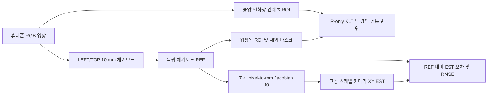
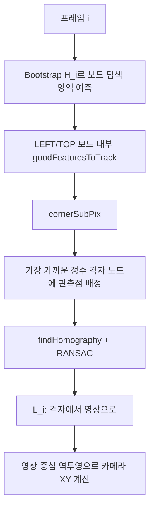
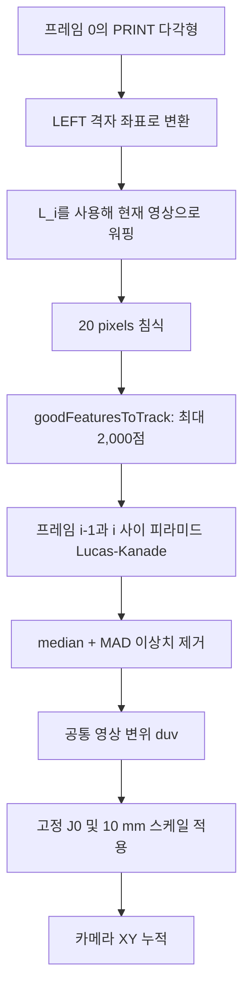

# XY v1 최종 검수: 체커보드 REF와 IR-only EST

## 실험 개요

본 실험의 목적은 열화상 모듈을 탑재한 카메라가 평면 위를 이동할 때, 별도 위치 센서 없이 영상만으로 카메라의 XY 이동량을 추정할 수 있는지 확인하는 것이다. 실제 열 센서 대신 중앙에 인쇄된 열화상 이미지를 배치하고, 그 주변의 10 mm 체커보드를 정확도 평가용 기준(REF)으로 사용했다.

핵심은 **REF와 EST에 사용하는 정보를 완전히 분리**한 것이다. REF는 LEFT/TOP 체커보드의 격자 코너를 매 프레임 독립적으로 적합하여 카메라 위치를 계산한다. 반면 EST는 체커보드·자·테이블 등 주변 정보를 모두 마스킹한 뒤, 중앙 열화상 인쇄물 내부 질감만 KLT로 추적해 위치를 누적한다. 따라서 EST가 체커보드 정보를 이용해 성능을 높이는 구조가 아니며, 체커보드는 오직 기준 궤적 생성과 초기 좌표계 설정에만 쓰인다.

실험 영상은 카메라를 손으로 들고 테이블 평면 위에서 이동시킨 1,206프레임(20.30초) 시퀀스이다. 두 방법이 산출한 프레임별 XY 궤적을 같은 좌표계에서 비교하고, 최종 위치 오차, 누적 RMSE, p95 오차, 정지 구간 드리프트, LEFT/TOP 체커보드 REF 간 일치도를 평가했다. 즉, 이 실험은 “중앙 열화상 영역의 영상 질감만으로 실제 평면 카메라 이동을 어느 정도까지 재현할 수 있는가”를 검증하는 모형 기반 위치추정 실험이다.

## 1. 결과와 적용 범위

이 패키지는 인쇄된 열화상 이미지를 촬영한 휴대폰 영상으로부터, 고정된 테이블 위 카메라의 평면 위치를 추정한다. 출력은 누적 카메라 위치 `(X_mm, Y_mm)` 및 프레임 간 변위이다. 카메라 높이와 자세는 고정되어 있고, 평면 XY 병진만 발생한다는 조건을 전제로 한다.

주 결과는 `fixed-scale` 추정기이다. 초기화 이후 추정기에 들어가는 특징점은 **중앙 열화상 인쇄물 ROI만** 사용한다. 체커보드는 EST 특징점으로 사용하지 않으며, 독립 기준 궤적(REF) 생성, 초기 스케일/방향 설정, 제외 마스크 정의에만 사용한다.

| 지표 | 값 |
|---|---:|
| 영상 | 1,206 프레임, 59.398 fps, 20.30 s |
| 측정 이동 거리 | 773 mm |
| 최종 오차, IR-only fixed-scale EST | 6.364 mm (이동 거리의 0.82%) |
| RMSE, IR-only fixed-scale EST | 2.230 mm |
| p95 오차 | 6.091 mm |
| 7.6 s 정지 구간 드리프트 | 0.017 mm |
| LEFT 대 TOP REF 차이 | median 0.112 mm, p95 0.516 mm |
| 원점 복귀 잔차 | 0.228 mm |

이 결과는 현재 모형 환경에서 인쇄물 질감만으로 평면 운동을 추정할 수 있음을 확인한다. 실제 마이크로볼로미터를 검증한 결과는 아니다. NETD, FPN, 셔터 보정, 저대비 열 장면은 본 실험 범위에 포함되지 않는다.

## 2. 산출물과 폴더 구성

결과 폴더는 산출물 유형별로 정리되어 있다. 파이프라인도 이 하위 폴더를 직접 사용하므로, 재생성해도 동일한 구성이 유지된다.

| 산출물 | 용도 |
|---|---|
| [data/trajectory.csv](data/trajectory.csv) | 프레임별 REF, EST, 오차, 신뢰도, REF 품질 값 |
| [visuals/trajectory.png](visuals/trajectory.png) | X/Y 궤적 및 추정 오차 그래프 |
| [visuals/overlay.mp4](visuals/overlay.mp4) | REF/EST 통합 검수 영상, 200 x 200 궤적 패널 포함 |
| [visuals/overlay_ref.mp4](visuals/overlay_ref.mp4) | REF 전용 영상: 체커보드 격자 관측만 표시 |
| [visuals/overlay_est.mp4](visuals/overlay_est.mp4) | EST 전용 영상: 중앙 열화상 인쇄물 KLT 추적만 표시 |
| [visuals/ref_est_trajectory_dashboard.mp4](visuals/ref_est_trajectory_dashboard.mp4) | REF/EST/XY 궤적/오차/누적 RMSE를 동기화해 하나로 표시한 영상 |
| [rerun/xy_v1_ref_est.rrd](rerun/xy_v1_ref_est.rrd) | 동기화 대시보드, 궤적, 오차, 누적 RMSE가 담긴 Rerun 기록 |
| [report.md](report.md) | 기존 상세 실험 보고서 및 해상도/노이즈 스윕 |
| [data/sweep.csv](data/sweep.csv) / [visuals/sweep_heatmap.png](visuals/sweep_heatmap.png) | 해상도 및 가산 노이즈 민감도 스윕 |

`02_실험/code`에서 영상과 Rerun 기록을 다시 생성하려면 다음을 실행한다.

```powershell
python report.py
python compose_xy_v1_dashboard.py
python export_xy_v1_rerun.py
rerun ../../03_결과/XY추정_v1/rerun/xy_v1_ref_est.rrd
```

## 3. 좌표계와 전체 데이터 흐름



세계 좌표계는 첫 유효 프레임의 LEFT 보드 격자이다. 격자 한 칸은 10 mm이며, 영상 중심은 다음과 같다.

$$
c = (960, 540)^T\ \text{pixels}.
$$

격자 좌표에서 영상 좌표로 가는 프레임별 보드 호모그래피를 $L_i$라 하면, 보드 좌표계의 카메라 중심은 다음과 같이 구한다.

$$
p_i^{\mathrm{REF}} = 10\, L_i^{-1} c\quad[\mathrm{mm}].
$$

최종 REF는 위 위치에서 초기 정지 구간의 평균 위치를 뺀 값이다. TOP 보드 위치는 하나의 강인한 고정 2D 유사변환으로 LEFT 보드 좌표계에 맞추며, 독립적인 일관성 검증에만 사용한다.

## 4. REF: 체커보드 격자 기준 궤적

REF는 일반적인 특징점 누적 추적기가 아니다. 매 프레임 보드-영상 변환을 새로 적합하므로 랜덤 워크 누적을 줄인다.



1. 전역 프레임 간 유사변환 체인 $H_i$는 알려진 보드 영역을 전달하고 격자 대응을 예측하는 데만 사용한다.
2. LEFT와 TOP은 각각 독립 검출한다. 분리된 두 종이를 합치면 잘못된 보드 간 격자 구조가 만들어질 수 있으므로 병합하지 않는다.
3. `goodFeaturesToTrack`으로 보드 코너를 찾고 `cornerSubPix`로 위치를 보정한다.
4. 예측된 역격자 변환을 사용하여 검출 코너 $u_j$를 가장 가까운 정수 격자 노드에 배정한다.

$$
q_j = L_i^{-1}u_j,\qquad n_j = \operatorname{round}(q_j).
$$

다음 조건을 만족하는 대응만 유지한다.

$$
\lVert q_j-n_j\rVert_\infty < 0.28.
$$

5. 정수 격자 노드와 관측 영상 코너로 강인한 호모그래피를 적합한다.

$$
u_j \sim L_i n_j.
$$

6. 호모그래피는 매 프레임 독립적으로 다시 추정한다. 직전 프레임은 대응 예측에만 사용하며, 카메라 자세를 누적하는 용도가 아니다.

전체적으로 REF는 강하지만, 반복되는 체커보드 무늬 때문에 약 1% 프레임에서 한 격자 칸 차이의 모호성이 발생할 수 있다. 따라서 단일 프레임 피크보다 누적 지표와 LEFT/TOP의 median 일치도가 더 의미 있는 품질 지표다.

## 5. EST: 중앙 열화상 인쇄물 질감만 사용

EST는 체커보드, 커팅 매트, 자, 목재, 흰색 테두리를 의도적으로 제외한다. ROI는 먼저 LEFT 격자 좌표에서 정의한 중앙 열화상 인쇄물이고, 이후 $L_i$로 각 프레임 영상에 워핑한다.



프레임 $i-1$의 특징점 위치를 $a_j$, 프레임 $i$에서 KLT가 찾은 대응점을 $b_j$라고 하면 개별 영상 변위는 다음과 같다.

$$
d_j = b_j-a_j.
$$

공통 변위는 강인하게 계산한다. 먼저 모든 대응점에서 median 변위 $m$과 방사 잔차 $r_j$를 구한다.

$$
m = \operatorname{median}(d_j),\qquad r_j=\lVert d_j-m\rVert_2.
$$

이후 median absolute deviation(MAD) 게이트를 적용한다.

$$
r_j < 3(1.4826)\operatorname{MAD}(r_j)+0.5\ \text{px}.
$$

남은 점들의 median이 최종 공통 변위가 된다. 기록되는 inlier 비율은 추가로 1 px 일관성 게이트를 사용한다.

고정 pixel-to-lattice Jacobian은 첫 프레임의 영상 중심에서 계산한다.

$$
J_0 = \frac{\partial(L_0^{-1}u)}{\partial u}\bigg|_{u=c}.
$$

정지 장면이 영상에서 $\Delta u$만큼 이동하는 것은 카메라가 반대 방향으로 이동한 것에 해당하므로, 카메라 위치 갱신은 다음과 같다.

$$
p_i^{\mathrm{EST}} = p_{i-1}^{\mathrm{EST}} - 10\,J_0\,\Delta u_i.
$$

`fixed-scale`이 주 결과이며 초기화 이후 $J_0$는 고정한다. 선택 가능한 `oracle` 실험은 프레임별 REF Jacobian으로 $J_0$를 대체한다. 매 프레임 REF 정보를 주입하므로 비교 진단용일 뿐, 주 성능 지표로 사용하지 않는다.

## 6. 분리 영상의 의미

| 영상 | 표시되는 픽셀과 점 | 사용하거나 표시하지 않는 항목 |
|---|---|---|
| `overlay_ref.mp4` | LEFT/TOP 체커보드 픽셀 및 격자 적합에 사용된 코너 | 중앙 열화상 인쇄물 및 보드 외부 모든 질감 |
| `overlay_est.mp4` | 침식된 중앙 열화상 인쇄물 ROI 및 대표 IR KLT 궤적(최대 500개) | 모든 체커보드 및 주변 질감 |
| `overlay.mp4` | 통합 검수 화면 | 나란한 분석과 그래프 확인은 Rerun 사용 권장 |

수치 EST는 IR ROI 특징점을 최대 2,000개까지 사용한다. EST 전용 영상은 가독성을 위해 대표 궤적을 최대 500개만 그린다. 이 표시용 샘플링은 `trajectory.csv`나 보고된 정확도 수치에 영향을 주지 않는다.

## 7. Rerun 검수 절차

[xy_v1_ref_est.rrd](rerun/xy_v1_ref_est.rrd)를 Rerun에서 열고 `frame` 타임라인을 사용한다.

1. `video/dashboard`를 열어 동기화된 REF 전용, EST 전용, 궤적, 오차, RMSE 패널을 확인한다.
2. 더 큰 XY 그래프가 필요하면 `xy/trajectory/ref`와 `xy/trajectory/est`를 별도의 2D 뷰에 추가한다.
3. `metrics/error_norm_mm`, `metrics/cumulative_rmse_mm`, `metrics/tracked_points`, `metrics/inlier_ratio`, `metrics/ref_xcheck_mm` 스칼라 플롯을 추가한다.
4. 큰 오차 프레임으로 이동한 뒤, EST 추적 손실인지, 모션 블러인지, 체커보드 격자 모호성인지 확인한다.

RRD는 JPEG 인코딩 영상 스트림을 사용하며, 비압축 다중 GB 기록 대신 약 49 MB 크기로 저장된다.

## 8. 최종 판정과 한계

**이 모형 환경에서는 수용 가능:** IR-only 추정기는 773 mm 평면 카메라 운동에 대해 0.82% 최종 상대 오차, EST 추적 실패 없음, 낮은 정지 드리프트를 보였다. 체커보드 REF의 상호 일치도는 전체 EST 오차보다 충분히 작으므로, REF 대비 평가는 의미가 있다.

**과도한 해석 금지:** 이 영상은 실시간 열 센서 출력이 아니라 인쇄된 열화상 이미지다. 이동하는 환자는 시험하지 않았고, 핸드헬드 촬영으로 약 +2.5도 roll 변화와 약 +/-3~4% 스케일 변화가 있다. 임상 또는 하드웨어 선정 결론을 내리기 전에는 실제 열영상 출력, 고정 장착 카메라, 움직이는 피사체를 포함한 추가 실험이 필요하다.
