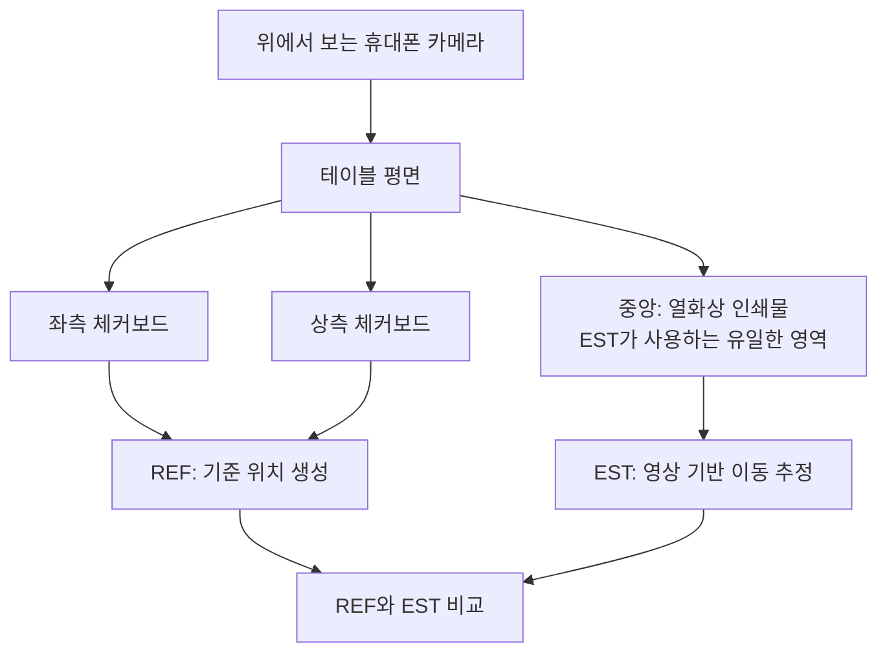
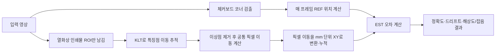

# XY 이동 추정 v1 — 이해하기 쉬운 구현 보고서

> **이 문서의 목표**: “열화상 영상만 보고 카메라가 평면 위에서 얼마나 움직였는가?”를 어떻게 계산했고, 결과 `6.36 mm (0.82%)`를 어디까지 믿어도 되는지 쉽게 설명한다.  
> 원본의 세부 수치·재현 절차는 [`report.md`](report.md), 검수용 기술 설명은 [`FINAL_REVIEW.md`](FINAL_REVIEW.md)에 남겨 두었다.

---

## 0. 먼저, 이 실험이 말하는 것과 말하지 않는 것

### 결론 한 문장

중앙의 **열화상 인쇄물 안쪽 질감만** 이용해 카메라의 평면 XY 이동을 누적했을 때, 약 **773 mm**를 움직인 실험에서 끝 위치가 기준 위치와 **6.36 mm**, 즉 **0.82%** 차이 났다.

쉽게 말하면, 자 없이 바닥 무늬를 보며 “내가 얼마나 옆으로 움직였는지”를 기록한 뒤, 체커보드 자로 만든 정답 기록과 비교한 실험이다.

### 이 실험에서 확인한 것

- 인쇄된 열화상 이미지처럼 **질감이 있는 영역**이라면, 그 영역만으로도 카메라의 XY 이동을 끊기지 않고 추정할 수 있었다.
- 7.6초 동안 카메라를 완전히 놓아둔 구간에서 추정값 변화는 **0.017 mm**로 매우 작았다.
- 낮은 해상도와 잡음을 흉내 낸 조건에서도 추적 자체는 끊기지 않았다.

### 아직 확인하지 못한 것

- 이것은 **실제 열화상 센서 영상이 아니라**, 열화상 사진을 인쇄한 종이를 RGB 휴대폰으로 촬영한 영상이다.
- 사람이나 환자처럼 **피사체 자체가 움직일 때**, 카메라 이동과 피사체 움직임을 분리할 수 있는지는 검증하지 않았다.
- 따라서 이 결과만으로 “특정 열화상 모듈은 의료 현장에서 충분하다”라고 결론 내릴 수는 없다.

---

## 1. 왜 XY 이동을 추정해야 하나?

열화상 카메라가 몸 표면이나 침상 위를 촬영하면서 이동하면, 화면에서 온도 패턴이 움직인다. 그런데 이 움직임은 두 원인이 섞여 보일 수 있다.

1. **카메라가 움직임**: 같은 대상이 화면 안에서 반대 방향으로 이동한다.
2. **대상이 움직임**: 환자·피부·옷 등이 실제로 움직인다.

이 v1 실험은 우선 첫 번째 문제만 떼어내었다. 즉, “대상이 고정돼 있다고 가정하면 영상 무늬만으로 카메라의 평면 이동을 얼마나 잘 알아낼 수 있는가?”를 확인했다.

이것은 최종 의료 응용의 완성본이라기보다, 이후 피사체 움직임을 다루기 전에 필요한 **카메라 이동 보정의 기초 성능 검증**이다.

---

## 2. 실험 장면을 한눈에 보기

커팅매트 위에 중앙에는 열화상 사진 인쇄물을 놓고, 주변에는 10 mm 간격 체커보드를 놓았다. 카메라를 위에서 내려다보게 한 뒤, 손으로 좌우·상하 방향으로 움직였다.



여기서 가장 중요한 설계 원칙은 **정답을 만드는 정보와 성능을 평가받는 정보의 분리**다.

| 구분 | 사용한 영역 | 하는 일 | 체커보드를 사용했는가? |
|---|---|---|---|
| REF (reference) | 좌측·상측 체커보드 | 비교 기준이 되는 카메라 위치 계산 | 예 |
| EST (estimate) | 중앙 열화상 인쇄물 내부 | 실제로 시험할 XY 이동 추정 | 아니오 |

따라서 EST가 체커보드의 규칙적인 무늬를 몰래 이용해서 좋은 결과를 낸 것은 아니다. 체커보드는 기준 궤적을 만들고, 시작할 때 픽셀을 mm로 바꾸는 기준을 잡는 데만 사용했다.

### 영상과 이동 구성

| 항목 | 값 | 뜻 |
|---|---:|---|
| 영상 길이 | 1,206 프레임 / 20.30초 | 약 59.4 fps |
| 실제 비교 이동거리 | 773 mm | 이동 구간들을 모두 합한 거리 |
| 처음 정지 구간 | 0.03–7.68초 | 카메라를 테이블에 **완전히 놓은** 유일한 구간 |
| 주 이동 방향 | 영상 세로축 방향 | 전체 이동의 약 92% |
| 체커보드 한 칸 | 10 mm | 실제 길이 기준 |

후반의 “정지” 구간은 손에 카메라를 든 채 멈춘 구간이다. 수 mm 정도 부드럽게 흔들릴 수 있으므로, 센서의 정지 드리프트를 평가할 때는 사용하지 않았다.

---

## 3. 핵심 용어: REF와 EST를 구분하면 전체가 쉬워진다

### REF = 비교용 기준 궤적

REF는 “진짜 위치”에 가장 가깝게 만들고자 한 기준이다. 체커보드의 한 칸이 정확히 10 mm임을 이용해 영상 중심이 체커보드 좌표계에서 어디에 있는지 매 프레임 계산한다.

REF는 절대적인 진실(ground truth)은 아니다. 다만 좌측 보드와 상측 보드로 **서로 독립적으로** 위치를 계산해 둘이 얼마나 일치하는지 검사했기 때문에, EST를 평가할 만큼 충분히 신뢰할 수 있는 기준인지 검증했다.

### EST = 실제로 성능을 시험한 추정기

EST는 중앙 열화상 인쇄물의 작은 명암 무늬를 프레임마다 따라간다. 예를 들어 인쇄물 속 밝은 윤곽이나 어두운 점이 화면에서 3픽셀 아래로 움직였다면, 카메라는 반대 방향으로 일정량 이동했다고 해석한다. 이 작은 이동들을 프레임마다 더하면 전체 XY 궤적이 된다.

### 한 비유로 정리

- **REF**: 바닥에 있는 눈금자(체커보드)를 읽어서 작성한 정답 노트
- **EST**: 바닥의 무늬만 보면서 걸음을 세어 작성한 위치 노트
- **검증**: 두 노트의 같은 시각 위치를 빼서, EST 노트가 얼마나 틀렸는지 계산

---

## 4. 전체 처리 흐름



처리 결과의 중심 파일은 [`data/trajectory.csv`](data/trajectory.csv)이다. 프레임마다 `REF X/Y`, `EST X/Y`, 두 값의 차이, 추적점 수, ROI 가시성, 체커보드 품질 등이 한 줄로 저장돼 있다.

### 4.1 이 방법론을 선택한 이유와 전제

이 문제에는 특징점 매칭, 광류(Optical Flow), IMU 융합, SLAM 등 여러 방법이 가능하다. v1에서는 아래 이유로 **희소 특징점 + 피라미드 KLT + 강인한 공통 이동량**을 택했다.

| 선택 | 선택한 이유 | 이 실험에서의 장점 | 주의점 |
|---|---|---|---|
| 희소 특징점 추적 | 전체 모든 픽셀보다, 정보가 많은 점만 추적 | 계산이 가볍고 이동 벡터의 품질을 점별로 확인 가능 | 질감이 너무 약하면 점 자체가 부족해짐 |
| 피라미드 KLT | 인접 프레임 간 작은 이동에 매우 효율적 | 59.4 fps 영상에서 프레임별 이동을 안정적으로 계산 | 큰 회전·큰 스케일 변화에는 약함 |
| 중앙값 + MAD 이상점 제거 | 일부 점이 틀려도 다수의 공통 이동을 보존 | 가림·블러·오추적에 강함 | 서로 다른 물체가 함께 크게 움직이면 다수결이 깨질 수 있음 |
| 초기 고정 Jacobian | 실제 장비의 고정 높이·방향 전제를 직접 반영 | REF 없이 열린 루프로 동작 가능 | 핸드헬드처럼 높이·롤이 바뀌면 축척 오차가 누적됨 |

이 방법이 성립하려면 다음 가정이 필요하다.

1. **평면 가정**: 추적하는 표면은 대체로 하나의 평면이다.
2. **강체 배경 가정**: v1에서는 인쇄물이 움직이지 않는다. 따라서 다수 특징점이 하나의 공통 이동을 가진다.
3. **밝기 보존 가정**: 같은 점의 명암은 바로 다음 프레임에서도 크게 바뀌지 않는다.
4. **작은 프레임 간 이동 가정**: 인접 프레임 이동이 충분히 작아 같은 무늬를 찾을 수 있다.
5. **고정 카메라 자세 가정**: 주 결과인 `fixed-scale`은 높이·방향이 일정하다고 가정한다.

이 중 1–4는 KLT가 작동하기 위한 영상 가정이고, 5는 픽셀을 mm로 고정 변환하기 위한 시스템 가정이다. 실제 환자가 움직이면 2번이 깨질 수 있으므로, 그 경우에는 사람 움직임과 카메라 움직임을 분리하는 별도 단계가 필요하다.

---

## 5. 기준 위치(REF)는 어떻게 만들었나?

### 5.1 체커보드는 왜 좋은 기준인가?

체커보드는 교차점들이 10 mm 간격으로 반복된다. 한 프레임에서 교차점들을 찾아 “이 점은 격자 좌표 `(i, j)`이고 화면에서는 `(u, v)`에 보인다”는 대응을 많이 만들 수 있다. 이 대응으로 영상의 원근 왜곡까지 포함한 변환(호모그래피)을 구한다.

그다음 영상 중심점 `(960, 540)`을 역으로 체커보드 평면에 투영하면, 해당 순간 카메라가 보드 위 어느 위치에 있는지 알 수 있다.

중요한 점은 **위치를 전 프레임 위치에 계속 더해 가지 않았다는 것**이다. 매 프레임 체커보드를 새로 읽어 위치를 계산했다.

#### REF의 기하학 수식

체커보드 평면의 격자 좌표를 \(q=(x_g,y_g,1)^T\), 영상 픽셀 좌표를 동차좌표 \(\tilde u=(u,v,1)^T\)라 하자. 평면을 카메라로 보면 원근 효과가 생기므로 둘의 관계는 3×3 호모그래피 \(L_i\)로 표현한다.

$$
\lambda\tilde u = L_i q
$$

- \(i\): 현재 프레임 번호
- \(L_i\): 체커보드 격자 평면에서 해당 프레임 영상으로 가는 변환
- \(\lambda\): 동차좌표의 크기항으로, 마지막에 \(u,v\)로 나눠 없어진다.

영상 중심 \(c=(960,540,1)^T\)을 이 변환의 반대 방향으로 보내면, 영상 중심이 체커보드 좌표계의 어느 위치를 보고 있는지 구할 수 있다.

$$
q_{c,i}=L_i^{-1}c, \qquad
p_i^{\mathrm{REF}}=10\,[q_{c,i,x},q_{c,i,y}]^T\ \text{mm}
$$

여기서 `10`을 곱한 이유는 체커보드 한 칸이 10 mm이기 때문이다. 마지막으로 처음 완전 정지 구간의 평균 위치를 빼서 그 위치를 \((0,0)\) 원점으로 정했다.

### 5.2 왜 누적 방식에서 독립 적합 방식으로 바꿨나?

처음 방식은 프레임 1→2, 2→3, 3→4의 변환을 계속 곱해 가는 방식이었다. 각 프레임의 작은 오차가 1,000프레임 이상 누적되면 왕복 뒤 원점으로 돌아왔을 때 3–4 mm 정도의 드리프트가 생겼다.

이를 다음처럼 변경했다.

| 이전 방식 | 최종 방식 |
|---|---|
| 프레임 간 움직임을 계속 누적 | 매 프레임 체커보드 격자를 새로 적합 |
| 작은 오차가 시간이 지날수록 쌓임 | 누적 오차가 원리상 크게 줄어듦 |
| 체인은 위치 계산에도 사용 | 체인은 “다음 보드가 어디쯤인지” 예측에만 사용 |

이 덕분에 첫 정지 7.6초 구간의 REF 누적 드리프트는 0.0377 mm로 작아졌다.

### 5.3 REF가 충분히 믿을 만한지 확인한 결과

| 확인 항목 | 결과 | 해석 |
|---|---:|---|
| 완전 정지 7.6초의 REF 드리프트 | 0.0377 mm | REF 자체의 흔들림은 작음 |
| 약 200 mm 왕복 뒤 원점 통과 잔차 | 0.2277 mm | 왕복 일관성이 좋음 |
| LEFT와 TOP 보드 위치 차이(중앙값) | 0.1120 mm | 독립 보드끼리 매우 잘 맞음 |
| 픽셀당 길이 차이 | 0.15% 이내 | 두 보드의 축척이 일관됨 |

이 결과 때문에 REF 대비 EST의 누적 오차 비교는 의미가 있다. 하지만 반복무늬인 체커보드의 특성상, 약 1% 프레임에서는 코너가 이웃 격자 칸으로 잘못 연결되는 단발성 오류가 있었다. 이때 REF 순간 위치가 최대 약 5 mm 튈 수 있다.

**따라서 해석 원칙은 다음과 같다.**

- 전체 궤적, 최종 오차, RMS처럼 여러 프레임을 종합한 결과는 비교적 신뢰할 수 있다.
- 특정 한 프레임의 큰 오차를 인용할 때는 REF도 최대 5 mm 정도 순간적으로 튈 수 있음을 함께 밝혀야 한다.

---

## 6. 열화상 영역만으로 XY를 추정하는 방법(EST)

### 6.1 관심영역(ROI)을 엄격히 제한했다

중앙 인쇄물의 다각형 영역만 남기고, 테두리는 20픽셀 더 안쪽으로 줄였다(침식). 그래서 다음 정보는 EST에 들어가지 않는다.

- 체커보드
- 커팅매트 격자
- 나무판, 자
- 종이의 흰 여백

6개 표본 프레임에서 추정 ROI와 체커보드의 겹침은 **0 픽셀**로 확인됐다. 이는 “열화상 이미지의 텍스처만 사용했다”는 주장에 대한 직접 점검이다.

### 6.2 KLT는 무엇을 하나?

KLT(Kanade–Lucas–Tomasi)는 프레임 \(i-1\)에서 찾은 특징점이 프레임 \(i\)에서 어디로 옮겨 갔는지 구하는 **국소적 광류 추정 알고리즘**이다. 여기서 “국소적”이란, 점 하나 주변의 작은 창(window)에서는 물체가 거의 같은 방향과 같은 크기로 움직인다고 보는 뜻이다.

#### (1) 먼저, 왜 모서리 점을 고르는가?

평평하게 밝은 영역은 어느 방향으로 움직여도 거의 똑같이 보인다. 수직선만 있는 영역도 선을 따라 움직인 양은 알기 어렵다. 반면 가로·세로 방향 명암 변화가 모두 있는 모서리는 2차원 이동을 잘 구분할 수 있다.

본 구현은 `goodFeaturesToTrack`으로 ROI 안에서 최대 **2,000개**의 모서리점을 선택했다. 설정은 품질 임계값 `0.01`, 점 사이 최소 간격 `8 px`이다. 선택된 점만 다음 프레임으로 넘겨 KLT를 수행한다.

#### (2) KLT의 가장 기본 가정: 밝기 보존

프레임 \(i-1\)의 영상 밝기를 \(I(x,y,t)\)라고 하자. 한 점이 \(d=(u,v)^T\)만큼 움직여도 그 점 고유의 밝기는 바로 다음 프레임에서 거의 같다고 가정한다.

$$
I(x,y,t) \approx I(x+u,\ y+v,\ t+\Delta t)
$$

이 가정은 노출 변화, 초점 변화, 반사 변화가 작을 때 잘 성립한다. 그래서 실제 열화상 적용에서는 셔터 보정이나 갑작스러운 온도 스케일 변화가 KLT 성능을 해칠 수 있다.

#### (3) 비선형 식을 작은 이동에 대해 선형화한다

\((u,v)\)가 한 프레임 사이에서 작다고 보고 우변을 1차 Taylor 전개하면 다음 식이 나온다.

$$
I_xu+I_yv+I_t=0
$$

- \(I_x, I_y\): 영상 밝기의 가로·세로 기울기. 즉, 그 주변 무늬가 얼마나 선명한가.
- \(I_t\): 두 프레임 사이에서 측정된 밝기 변화.
- \(u,v\): 우리가 구하고 싶은 해당 점의 픽셀 이동량.

한 픽셀만 보면 식은 하나인데 미지수 \(u,v\)가 두 개라서 풀 수 없다. 그래서 특징점 주변 창 \(W\) 안의 많은 픽셀에 대해 같은 이동 \((u,v)\)을 적용하고, 오차 제곱합이 가장 작아지는 값을 찾는다.

$$
\underset{u,v}{\operatorname{minimize}}
\sum_{(x,y)\in W}
\left[I_x(x,y)u+I_y(x,y)v+I_t(x,y)\right]^2
$$

이를 행렬로 쓰면 다음의 작은 2×2 선형방정식이 된다.

$$
\underbrace{\sum_W
\begin{bmatrix}
I_x^2 & I_xI_y\\
I_xI_y & I_y^2
\end{bmatrix}}_{G}
\begin{bmatrix}u\\v\end{bmatrix}
=-
\sum_W
\begin{bmatrix}I_xI_t\\I_yI_t\end{bmatrix}
$$

왼쪽의 \(G\)를 구조 텐서(structure tensor)라고 한다. \(G\)의 두 고유값이 모두 충분히 크면, 가로·세로 양쪽으로 정보가 있는 좋은 모서리다. `goodFeaturesToTrack`의 Tomasi 기준도 본질적으로 이 작은 고유값이 큰 점을 고르는 방법이다.

#### (4) 큰 이동도 다루기 위한 피라미드

위 선형화는 이동이 아주 작을 때만 정확하다. 그래서 실제 구현은 영상을 여러 해상도로 줄인 피라미드에서 수행한다.

1. 가장 작은 영상에서 큰 이동을 먼저 대략 찾는다.
2. 한 단계 더 큰 영상으로 올라가 이전 해를 확대해 초기값으로 쓴다.
3. 원본 해상도에서 마지막으로 세밀하게 보정한다.

OpenCV의 `calcOpticalFlowPyrLK`를 사용했으며, 창 크기는 **21×21 px**, 최대 피라미드 단계는 **3**이다. 이 설정은 `59.4 fps` 연속 영상의 프레임 간 이동을 찾는 데 사용됐다. 피라미드는 추적 가능한 이동 범위를 넓혀 주지만, 너무 큰 모션블러나 장면 변화까지 해결하지는 못한다.

#### (5) 본 구현에서 KLT가 산출하는 값

프레임 \(i-1\)의 특징점 \(a_j\)가 프레임 \(i\)에서 \(b_j\)로 추적되면, 점 \(j\)의 이동량은 다음이다.

$$
d_j=b_j-a_j
$$

KLT는 모든 점에 대해 \(d_j\)를 하나씩 만든다. 그러나 카메라가 평면 위에서 이동하고 인쇄물이 고정돼 있다면, 정상적으로 추적된 다수의 \(d_j\)는 거의 같은 값이어야 한다. 다음 절에서 이 많은 벡터를 하나의 신뢰할 수 있는 카메라 이동으로 합친다.

예를 들어 대부분의 점이 화면에서 오른쪽으로 2픽셀 움직였다면, 고정된 인쇄물이 오른쪽으로 움직인 것이므로 카메라는 실제로 왼쪽으로 움직였다고 계산한다. 부호가 반대가 되는 이유가 이것이다.

### 6.3 이상점은 어떻게 제거했나?

특징점은 흐림, 가림, 반복무늬, 잘못된 대응 때문에 엉뚱한 곳으로 갈 수 있다. 이를 그대로 평균 내면 일부 큰 오류가 전체 이동량을 망칠 수 있다. 그래서 각 프레임에서 다음의 강인한(robust) 집계를 사용했다.

1. 모든 추적점 이동 \(d_j\)의 성분별 중앙값 \(m\)을 구한다.

   $$m=\operatorname{median}_j(d_j)$$

2. 각 점이 중앙 이동에서 얼마나 떨어졌는지 거리 잔차를 구한다.

   $$r_j=\lVert d_j-m\rVert_2$$

3. 잔차의 중앙값 기반 산포인 MAD를 구한다.

   $$\operatorname{MAD}=\operatorname{median}_j\left|r_j-\operatorname{median}(r)\right|$$

4. 다음 조건을 만족하는 점만 남긴다. 이 과정을 최대 5회 반복한다.

   $$r_j < 3\times1.4826\times\operatorname{MAD}+0.5\ \text{px}$$

`1.4826`은 정규분포에서 MAD를 표준편차에 맞추기 위한 보정계수이고, `0.5 px`은 산포가 아주 작을 때 문턱이 0이 되지 않게 하는 여유항이다. 최종 공통 이동량은 살아남은 점들의 중앙값이다.

$$
\Delta u_i=\operatorname{median}_{j\in\mathrm{inlier}}(d_j)
$$

안전장치로 KLT가 성공한 점과 MAD 통과점이 **30개 미만**이면 해당 프레임을 정상 추적으로 쓰지 않는다. 또한 최종 공통 이동에서 1 px 이내인 원래 추적점 비율을 `inlier_ratio`로 기록한다. 실제 결과에서는 이 비율의 중앙값이 **0.99**, 추적 실패 프레임은 **0개**였다.

### 6.4 픽셀을 mm로 바꾸는 방법: Jacobian

KLT가 주는 \(\Delta u_i=(\Delta u,\Delta v)^T\)의 단위는 픽셀이다. 그러나 필요한 출력은 바닥 평면의 mm 단위 \((\Delta X,\Delta Y)^T\)다. 화면에서 1픽셀 움직였다고 실제로 항상 같은 mm만큼 움직이는 것은 아니며, 카메라 높이·롤·원근 때문에 X와 Y가 섞일 수도 있다.

그래서 시작 프레임 체커보드 호모그래피의 역변환 \(L_0^{-1}\)을 영상 중심 근처에서 미분해 2×2 Jacobian \(J_0\)를 만들었다.

$$
J_0=
\left.
\frac{\partial\left(L_0^{-1}u\right)}{\partial u}
\right|_{u=c}
\quad\left[\frac{\text{격자 칸}}{\text{pixel}}\right]
$$

구현에서는 복잡한 미분식을 직접 전개하지 않고, 중심 \(c\)와 중심에서 각각 1픽셀 옆인 \(c+(1,0)\), \(c+(0,1)\)을 역호모그래피에 넣어 수치 미분으로 두 열을 만들었다. 이 방식은 원근 효과와 축 방향 섞임을 함께 반영한다.

체커보드 한 칸은 10 mm이고, 카메라 이동은 화면 속 고정 장면의 이동과 부호가 반대이므로 최종 업데이트 식은 다음과 같다.

$$
p_i^{\mathrm{EST}}
=p_{i-1}^{\mathrm{EST}}
-10\,J_0\,\Delta u_i
$$

주 결과인 `fixed-scale`은 \(J_0\)를 시작 시점에 한 번만 정하고 끝까지 고정한다. 이것이 실제 제품에서 카메라 높이와 방향을 고정한다는 전제다. 참고용 `oracle`은 \(J_0\) 대신 매 프레임 \(J_i\)를 사용한다. `oracle`은 매 프레임 REF 정보를 받으므로 실제 주 성능이 아니라, 핸드헬드 축척·방위 변화가 만든 오차를 분리하는 진단 도구다.

### 6.5 프레임 하나를 처리하는 실제 순서

```text
입력: 이전 회색 프레임, 현재 회색 프레임, 이전 ROI 특징점, 현재 프레임의 ROI 마스크

1. 현재 ROI가 영상 안에 충분히 보이는지 확인한다. (가시면적 5% 이상)
2. 이전 특징점이 최소 30개 있는지 확인한다.
3. 피라미드 KLT(21×21 창, level 3)로 이전 점을 현재 프레임으로 보낸다.
4. KLT 성공 점이 30개 이상인지 확인한다.
5. 모든 점의 이동 벡터에 중앙값 + MAD 이상점 제거를 적용한다.
6. 남은 점의 중앙 이동 Δu_i를 J0와 10 mm 격자 크기로 mm 변환한다.
7. 부호를 반대로 하여 이전 카메라 위치에 누적한다.
8. 현재 ROI 안에서 새 특징점을 최대 2,000개 다시 검출하여 다음 프레임 준비를 한다.
```

매 프레임 특징점을 새로 검출하는 이유는, 오래 추적한 소수 점이 점점 사라지거나 한 곳에 몰리는 것을 막기 위해서다. 즉 “처음 잡은 2,000개 점을 영상 끝까지 고집해서 쫓는 방식”이 아니라, 매 프레임 현재 ROI에서 충분히 좋은 점을 다시 확보하는 방식이다.

---

## 7. 성능 결과를 쉽게 읽기

### 7.1 주 결과: fixed-scale

| 지표 | 값 | 쉬운 의미 |
|---|---:|---|
| 총 이동거리 | 773 mm | 카메라가 지나간 전체 거리 |
| 최종 오차 | **6.36 mm** | 마지막 위치에서 EST와 REF의 거리 차이 |
| 상대 최종 오차 | **0.82%** | 773 mm를 움직였을 때 약 0.82% 차이 |
| RMS 오차 | 2.23 mm | 전 구간에서의 전반적 오차 크기 |
| p95 오차 | 6.09 mm | 95% 프레임은 이 값 이하의 오차 |
| 최대 오차 | 6.78 mm | 단, REF 단발 글리치 영향 가능 |
| 완전 정지 7.6초 드리프트 | **0.017 mm** | 멈춰 있을 때 누적값이 거의 변하지 않음 |
| 추적 실패 | 0 프레임 | 영상 추적이 중간에 끊기지 않음 |

`최종 오차 6.36 mm`는 773 mm를 이동한 뒤 마지막 점에서 난 차이이다. “항상 6.36 mm 틀린다”는 뜻은 아니다. 전 구간 평균적 오차 크기는 RMS 2.23 mm로 봐야 한다.

### 7.2 X축과 Y축을 따로 보면 원인이 보인다

끝 위치에서 `EST − REF`는 `(-5.77 mm, -2.68 mm)`였다. 그런데 실제 이동의 92%는 Y축이었다. 그래프상 Y축은 REF와 EST가 거의 겹치고, 오차의 큰 부분은 거의 움직이지 않은 X축 쪽에 쌓였다.

이는 열화상 인쇄물의 질감이 부족해서라기보다, 손으로 카메라를 들면서 **카메라가 조금 회전하고 높이가 바뀐 영향**으로 해석된다.

---

## 8. 왜 6.36 mm 오차가 생겼나?

이 실험에서 카메라는 고정 장착이 아니라 손에 들려 있었다. REF로 역산해 보니 촬영 중 다음 변화가 있었다.

| 변화 | 관측 범위 | XY 추정에 미치는 영향 |
|---|---:|---|
| 카메라 롤(기울어짐) | 약 +2.55° 변화 | 주 이동축의 움직임 일부가 가로축 오차로 섞임 |
| 카메라 높이/축척 | 약 −2.81% ~ +4.22% | 1픽셀을 mm로 바꾸는 비율이 시간에 따라 달라짐 |
| 고속 구간의 모션블러 | 보드 선명도 약 27% 저하 | 특징점·코너 위치가 덜 정확해짐 |

이를 구분하려고 `oracle` 비교 실험도 했다. `oracle`은 실제 시스템에서는 쓸 수 없지만, 매 프레임 REF가 알려 주는 축척을 EST에 제공한 가상의 조건이다.

| 방식 | 최종 오차 | 의미 |
|---|---:|---|
| fixed-scale (주 결과) | 6.36 mm / 0.82% | 초기 축척·방위를 끝까지 고정 |
| oracle | 3.43 mm / 0.44% | 매 프레임 축척 변화를 알고 있다고 가정 |

둘의 차이는 9.75 mm 규모이며, 그 주된 원인은 핸드헬드 촬영의 롤·높이 변화다. 따라서 카메라를 실제처럼 고정 마운트에 장착하면, 이 목업에서 얻은 0.82%보다 `oracle`의 0.44%에 가까운 조건이 될 가능성이 있다. 다만 이는 **합리적인 기대**이지, 실제 열화상 모듈로 이미 입증된 성능은 아니다.

---

## 9. “열화상 텍스처가 부족해서 틀린 것인가?”를 확인한 대조 실험

같은 KLT 추정기를 중앙 열화상 인쇄물이 아니라 체커보드 영역에 적용했다. 만약 열화상 인쇄물의 질감이 문제였다면 체커보드에서 더 좋아져야 한다.

| 추적 영역 | 최종 오차 | 정지 드리프트 |
|---|---:|---:|
| 열화상 인쇄물 ROI | **6.36 mm (0.82%)** | **0.017 mm** |
| 좌측 체커보드 ROI | 8.13 mm (1.05%) | 0.103 mm |

오히려 체커보드 영역이 더 나빴다. 이 실험 조건에서는 성능 병목이 “열화상 인쇄물의 텍스처 부족”이라기보다, 프레임마다 아주 작은 이동을 계속 누적하는 방식과 핸드헬드 자세 변화였다는 근거가 된다.

---

## 10. 해상도와 노이즈를 낮춰 보면?

원본 영상을 여러 해상도로 줄인 뒤, 가산 잡음(σ = 0, 1, 2, 4, 8)을 넣어 총 25개 조건을 시험했다. FOV는 같게 유지했다.

### 핵심 결과

| 해상도 | 최종 누적 오차 범위 | 정지 드리프트 범위 | 추적 실패 |
|---|---:|---:|---:|
| 1920×1080 | 0.80–0.82% | 0.017–0.034 mm | 0 |
| 약 854×480 | 0.92–0.97% | 0.047–0.161 mm | 0 |
| 약 427×240 | 0.93–1.04% | 0.070–0.229 mm | 0 |
| 약 341×192 | 0.89–0.95% | 0.083–0.307 mm | 0 |
| 약 213×120 | 0.94–1.05% | 0.077–0.179 mm | 0 |

### 해석

- 모든 조건에서 추적은 끊기지 않았다. 근거는 [`data/sweep.csv`](data/sweep.csv)의 `lost_frames` 열이다. 해상도 5개 × 잡음 5개, 총 25개 조합에서 이 값이 모두 **0**이다.
- 누적 최종 오차는 0.8–1.05% 정도로 큰 차이가 없었다. 이 값은 해상도보다 핸드헬드 롤·높이 변화의 영향을 더 크게 받기 때문이다.
- 해상도의 영향은 정지 드리프트에서 더 분명했다. 원본 1080p의 0.017 mm가 120p급에서는 약 0.1 mm 수준으로 커졌다.

여기서 `lost_frames`는 단순히 “점 하나가 사라졌다”는 뜻이 아니다. 프레임별로 다음 중 하나라도 발생해 **XY 위치를 정상 업데이트하지 못한 프레임 수**를 센 값이다.

- 유효한 REF 또는 ROI가 없음
- ROI가 화면에 5% 미만만 보임
- 새로 검출하거나 KLT로 성공한 특징점이 30개 미만

따라서 `lost_frames = 0`은 이 목업 영상의 25개 열화 조건에서 위 실패 상태가 한 번도 발생하지 않았다는 뜻이다. 이 값은 [`02_실험/code/degrade.py`](../../02_실험/code/degrade.py)의 `one_run()` 실패 플래그와 그 합산 로직에서 생성된다. 다만 프레임마다 특징점을 다시 검출하는 구조이므로, **개별 특징점이 영상 전체 길이 동안 한 번도 사라지지 않았다**는 뜻은 아니다. 또한 인쇄물·RGB 영상에서의 결과이므로, 실제 열화상 모듈 및 실제 장면에서의 추적 연속성을 보장하지 않는다.

따라서 **이 특정 목업 영상의 XY 추정만** 보면 256×192급은 가능성이 있고 160×120급에서도 동작했다. 그러나 실제 열화상 모듈에는 NETD, FPN(고정 패턴 잡음), 셔터 보정, 저대비 피부 표면 등이 있으므로, 이 표를 그대로 모듈 선정 기준으로 쓰면 안 된다.

---

## 11. 숫자를 볼 때 주의할 점

### REF도 완벽한 정답은 아니다

REF의 LEFT/TOP 독립 측정 중앙값 차이는 0.112 mm로 매우 작지만, 반복되는 격자 때문에 약 1% 프레임에서 최대 약 5 mm의 순간 글리치가 발생한다. 그래서 다음처럼 읽는 것이 안전하다.

| 보고할 값 | 신뢰도 | 이유 |
|---|---|---|
| 최종 오차, RMS, 전체 궤적 | 높음 | 단발 글리치가 전체 결과에 평균화됨 |
| 특정 프레임의 최대 오차 | 주의 | REF 순간 글리치가 섞일 수 있음 |
| 프레임 간 아주 작은 증분 오차 | 제한적 | REF 자체 프레임 간 잡음 바닥(약 419 µm)에 막힘 |

### 렌즈 왜곡은 이번 영상에서는 큰 문제가 아니었다

체커보드로 자가 보정했을 때 왜곡 보정 전후의 격자 적합 RMS는 0.3107 px와 0.3104 px로 거의 같았다. 이 영상은 휴대폰 내부 보정이 이미 적용된 것으로 보이며, 이후 파이프라인에서는 렌즈 왜곡 보정을 생략했다. 이것이 “모든 카메라에서 왜곡 보정이 필요 없다”는 뜻은 아니다.

---

## 12. 의료 응용으로 가기 전, 다음 실험에서 반드시 바꿀 것

1. **실제 열화상 모듈을 사용한다.** 인쇄물 대신 실제 센서 출력으로 NETD·FPN·셔터 보정의 영향을 확인한다.
2. **카메라를 고정 마운트에 장착한다.** 높이와 롤을 고정해 `fixed-scale` 전제를 실제 조건과 맞춘다.
3. **움직이는 피사체를 넣는다.** 카메라 운동과 사람·피부의 실제 움직임을 분리하는 방법을 별도로 검증한다.
4. **노출·초점·화이트밸런스를 고정한다.** RGB 목업을 계속 쓸 때는 자동 노출/자동 화이트밸런스가 텍스처를 바꾸지 않게 한다.
5. **모션블러를 줄인다.** 셔터 속도를 높이고, 프레임 간 카메라 이동이 체커보드 반 칸(5 mm)보다 작게 촬영한다.
6. **참조 보드를 양 끝에 둔다.** 긴 이동 구간 전체에서 최소 한 장의 보드가 충분히 보이게 배치한다.

---

## 13. 산출물을 확인하는 순서

처음 보는 경우 다음 순서가 가장 이해하기 쉽다.

1. [`visuals/trajectory.png`](visuals/trajectory.png)를 열어 REF와 EST의 X/Y 궤적, 오차가 시간에 따라 어떻게 변하는지 본다.
2. [`visuals/overlay_est.mp4`](visuals/overlay_est.mp4)에서 EST가 정말 중앙 열화상 인쇄물 안의 점만 추적하는지 확인한다.
3. [`visuals/overlay_ref.mp4`](visuals/overlay_ref.mp4)에서 체커보드 REF가 어떻게 만들어졌는지 본다.
4. [`visuals/overlay.mp4`](visuals/overlay.mp4) 또는 [`visuals/ref_est_trajectory_dashboard.mp4`](visuals/ref_est_trajectory_dashboard.mp4)로 두 과정을 함께 검수한다.
5. 필요하면 [`data/trajectory.csv`](data/trajectory.csv)의 `err_norm_mm` 열로 프레임별 오차를 직접 확인한다.

---

## 14. 최종 요약

이 v1은 **고정된 평면 장면에서, 열화상 이미지 영역의 시각적 텍스처만으로 카메라 XY 이동을 누적할 수 있음**을 보여 주는 기초 검증이다. 773 mm 이동에 대해 6.36 mm(0.82%) 최종 오차와 0.017 mm 정지 드리프트를 얻었고, 추적은 한 프레임도 끊기지 않았다.

다만 이 수치는 실제 열화상 센서·실제 환자·고정 장착 환경에서 직접 얻은 성능이 아니다. 특히 피사체 움직임 분리와 실제 마이크로볼로미터 노이즈 특성은 다음 실험에서 검증해야 한다. 그러므로 현재 단계의 적절한 표현은 다음과 같다.

> **“열화상 영상 기반 XY 이동 보정의 가능성은 목업 환경에서 확인되었다. 의료 적용 및 모듈 선정 결론을 위해서는 실제 열화상 센서와 움직이는 피사체를 포함한 후속 검증이 필요하다.”**
